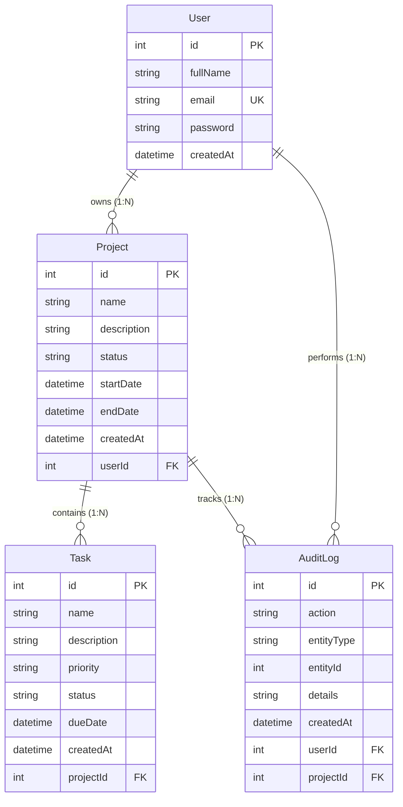

# Vanguard | Full Stack Project Management System

Vanguard is a secure, production-quality SaaS Project Management dashboard application. Authenticated users can create projects, track milestone tasks, and view aggregated performance charts.

## Technology Stack

- **Frontend:** React.js, Vite, Tailwind CSS, React Router DOM, Axios, React Hook Form, Recharts, Lucide Icons.
- **Backend:** Node.js, Express.js, JWT Auth, Bcrypt, Express Validator, Helmet, CORS, Morgan Logger, Express Rate Limit.
- **Database:** MySQL, Prisma ORM.

---

## Folder Structure

```text
pmsnew/
├── backend/
│   ├── prisma/
│   │   └── schema.prisma      # Prisma Schema model definitions
│   ├── src/
│   │   ├── controllers/       # Route request controllers
│   │   ├── middleware/        # JWT auth, Rate Limiting, Error handlers
│   │   ├── routes/            # Express routers
│   │   ├── services/          # Prisma database client & AuditLog service
│   │   ├── validators/        # express-validator checks
│   │   ├── utils/             # Custom errors, response formatting, token utilities
│   │   └── index.js           # Server bootstrap file
│   └── .env                   # Backend environment variables
├── frontend/
│   ├── src/
│   │   ├── components/        # Skeletons, Modals, EmptyStates, Toast notification contexts
│   │   ├── context/           # AuthContext (JWT session states & theme settings)
│   │   ├── layouts/           # Auth Layout & Responsive Dashboard workspace Layouts
│   │   ├── pages/             # Login, Register, Dashboard, Projects, Tasks, Profile, 404
│   │   ├── routes/            # App routes and security route guards
│   │   ├── services/          # Axios configurations, project/task/auth endpoints
│   │   ├── index.css          # CSS Variables, Tailwind layer classes
│   │   └── App.jsx            # State context wrappers
│   ├── index.html             # HTML core layout (Outfit/Inter fonts)
│   ├── tailwind.config.js     # Dark mode settings and brand themes
│   └── postcss.config.js      # PostCSS options
└── README.md                  # System Documentation
```

---

## Entity-Relationship (ER) Diagram

The database is built on MySQL using the following schema associations:



---

## Environment Variables Guide

### Backend (`backend/.env`)

Create a `.env` file in the `backend` folder with:

```env
PORT=5000
NODE_ENV=development
DATABASE_URL="mysql://<user>:<password>@<host>:<port>/<database_name>"
JWT_SECRET="your_secure_random_jwt_secret_phrase"
```

---

## Installation & Running Guide

### Prerequisites

- [Node.js](https://nodejs.org/) (v18+ recommended)
- A running [MySQL Server](https://www.mysql.com/) instance

### 1. Database Setup

1. Create a database in MySQL (e.g., `pmsnew_db`).
2. Update the `DATABASE_URL` in `backend/.env` with your correct database credentials.


### 2. Run Backend Server

In a terminal, execute:

```bash
# Navigate to backend
cd backend

# Install dependencies
npm install

# Run database migrations using Prisma
npx prisma migrate dev --name init

# Generate Prisma Client
npm run db:generate

# Start the server in Development mode
npm run dev
```

The server will spin up on(https://project-management-backend-sriq.onrender.com)
### 3. Run Frontend App

In a separate terminal, execute:

```bash
# Navigate to frontend
cd frontend

# Install dependencies
npm install

# Start the React Vite dev server
npm run dev
```

The application will start on (https://project-management-system-eight-zeta.vercel.app)

---

## API Endpoints Documentation

All endpoints return consistent JSON payloads. Protected endpoints require the token sent in the headers as:
`Authorization: Bearer <JWT_TOKEN>`

### Authentication Module

*   **POST** `/api/auth/register` (Register a new account)
    *   *Payload:* `{ "fullName": "Jane Doe", "email": "jane@example.com", "password": "Password123!" }`
    *   *Response (201 Created):* `{ "success": true, "message": "...", "data": { "user": { "id": 1, ... }, "token": "..." } }`
*   **POST** `/api/auth/login` (Account Login)
    *   *Payload:* `{ "email": "jane@example.com", "password": "Password123!" }`
    *   *Response (200 OK):* `{ "success": true, "message": "...", "data": { "user": { "id": 1, ... }, "token": "..." } }`
*   **POST** `/api/auth/logout` (Invalidate user session)
    *   *Headers:* `Authorization: Bearer <Token>`
    *   *Response (200 OK):* `{ "success": true, "message": "Logout successful." }`

### Project Module (Protected)

*   **GET** `/api/projects` (List projects owned by user)
    *   *Query Options:* `search=<name>`, `status=<NOT_STARTED|IN_PROGRESS|COMPLETED>`, `sortBy=<createdAt|name|startDate|endDate>`, `sortOrder=<asc|desc>`, `page=<num>`, `limit=<num>`
    *   *Response (200 OK):* Returns pagination metadata and list including task counters and computed `progressPercentage`.
*   **POST** `/api/projects` (Create a project)
    *   *Payload:* `{ "name": "Vanguard v1", "description": "...", "status": "NOT_STARTED", "startDate": "2026-06-20", "endDate": "2026-07-30" }`
*   **GET** `/api/projects/:id` (Retrieve single project by ID)
*   **PUT** `/api/projects/:id` (Update project details)
*   **DELETE** `/api/projects/:id` (Permanently delete project and its tasks)

### Task Module (Protected)

*   **GET** `/api/tasks` (List tasks across user projects)
    *   *Query Options:* `projectId=<num>`, `status=<PENDING|IN_PROGRESS|COMPLETED>`, `priority=<LOW|MEDIUM|HIGH>`, `search=<name>`, `sortBy=<createdAt|dueDate|priority>`, `sortOrder=<asc|desc>`, `page=<num>`, `limit=<num>`
*   **POST** `/api/tasks` (Create a task in a project)
    *   *Payload:* `{ "name": "API tests", "description": "...", "priority": "HIGH", "status": "PENDING", "dueDate": "2026-06-25", "projectId": 1 }`
*   **GET** `/api/tasks/:id` (Retrieve single task)
*   **PUT** `/api/tasks/:id` (Update task / mark complete)
*   **DELETE** `/api/tasks/:id` (Remove task)
*   **GET** `/api/tasks/export` (Export matching tasks as downloadable CSV file attachment)
    *   *Query Options:* Same as `GET /api/tasks`

### Dashboard Module (Protected)

*   **GET** `/api/dashboard/stats` (Retrieve aggregations for cards and charts)
    *   *Response (200 OK):* Includes:
        *   `summary`: Count of total projects, projects by status, total tasks, task completion rates.
        *   `charts`: formatted arrays ready for Recharts (priority groups, project statuses, completion ratios).
        *   `recentTasks`: Array of 5 latest tasks.
        *   `recentLogs`: Array of 8 latest audit timeline history logs.

---

## Security Implementations

1.  **JWT Verification:** Protected routes verify headers for valid tokens. Sessions expire after 7 days.
2.  **Rate Limiting:** Stricter rate limits on sign-ins (15 attempts per 15 mins) and general limits on API calls.
3.  **Password Protection:** Encrypt passwords using `bcryptjs` before committing to MySQL.
4.  **Helmet Integration:** Sets HTTP headers preventing standard vectors like Cross-Site Scripting (XSS).
5.  **CORS Setup:** Restricts cross-origin resource sharing to designated clients.
6.  **SQL Injection Protection:** Queries parameterized natively by Prisma ORM.

---

## Deployment Instructions

### Production Deployment

1.  **Build Frontend assets:**
    Navigate to `frontend/` and run:
    ```bash
    npm run build
    ```
    This generates static files in `frontend/dist/`.
2.  **Setup Web Server (e.g. Nginx):**
    Configure Nginx to serve the `frontend/dist` directory for the main domain and reverse-proxy `/api` requests to the Node backend running at port `5000`.
3.  **Run Node Server in Production:**
    Set `NODE_ENV=production` inside `backend/.env`. Install PM2 to keep the Node process running:
    ```bash
    npm install -g pm2
    cd backend
    pm2 start src/index.js --name "vanguard-api"
    ```
